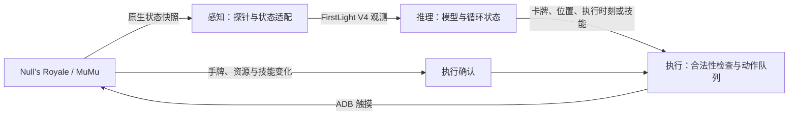

# RoyaleHarness

**面向《皇室战争》的感知、推理与自动操控框架。**

A perception–inference–action harness for Clash Royale.

RoyaleHarness 将 FirstLight 的 V4 策略模型接入 MuMu 中运行的 Null’s Royale，
完成 **获取实时战况 → 模型决策 → 触摸下牌 → 执行结果确认** 的闭环。
项目重点是让已有模型实际运行于游戏中，包括观测适配、决策调度、坐标转换和动作执行。

当前版本：**`v0.1.0-preview`**。
目前使用原生数据感知；视觉感知是后续方向。当前接入目标为 Null’s Royale，未适配官方客户端。

[Agent 协助配置](#让-agent-协助配置) · [开始使用](#开始使用) · [配置指南](docs/SETUP.md) · [架构说明](docs/ARCHITECTURE.md) · [路线图](#路线图)

## 让 agent 协助配置

在支持仓库指令的编程助手中打开项目，可以这样提出任务：

> 请阅读 AGENTS.md，帮我把 RoyaleHarness 配置到我指定的 MuMu 实例。
> 按配置技能发现环境、填写本地设置并验证运行；需要我进入对战时告诉我。

[AGENTS.md](AGENTS.md) 是工作入口，
[配置技能](.agents/skills/configure-royaleharness/SKILL.md) 说明如何识别实例、选择端口、
填写路径与账号、校准并验证闭环。是否自动发现技能取决于助手；不能自动加载时，直接让它阅读这些文件即可。
这些文件提供操作指引，不会自行执行配置。

## 项目如何工作

| 层级 | 当前实现 | 主要职责 |
| --- | --- | --- |
| 感知 | 原生只读探针与 Python 适配器 | 读取实时状态，核对对象身份、席位、坐标及关系，转换为模型观测 |
| 推理 | FirstLight V4 与已有权重 | 保留 LSTM、动作历史、每 5 tick 决策窗口和顺序微动作 |
| 执行 | ADB / Android 触摸输入 | 选牌、下牌、已支持英雄的技能点击，检查时效并等待结果确认 |

动作通过触摸执行，后台探针用于状态获取与执行观测。项目目前复用已有权重，
不包含新模型训练流程；运行无需 `IL_Replay`，也无需安装离线训练引擎或 Clash-Royale-Battle-Engine。

## 当前能力

- **实时自动下牌**：将观测送入原模型，把决策转换为屏幕操作，并跟踪执行结果。
- **连续运行控制台**：支持实时显示模型决策、暂停/恢复、运行中切换权重、自动处理结算并开启下一局；`--attach-active` 支持从进行中的对局接管。
- **自动表情**：控制台支持手动发送和按周期自动发送表情；使用预校准触摸坐标，不依赖图像识别。
- **连续对战生命周期**：自动处理结算页的两个 `OK` 按钮、返回大厅和下一局启动；遇到不确定画面会安全暂停，不重复点击。
- **局面预测**：可选连接独立离线引擎，将当前已确认局面、己方已确认动作和部署时序向前外推后再提供给模型；对手完整回放或引擎不兼容时自动关闭，避免错误镜像污染模型输入。
- **坐标与席位适配**：处理模型格子、原生世界坐标和屏幕位置之间的转换，提供地面校准与核对工具。
- **战况输入**：接入手牌与循环、单位与塔、持续效果、攻击目标、部分投射物与战斗状态。
- **部署分组**：根据已验证来源关联同次部署的成员，支持不同批次分组和阵亡后的成员减少。
- **特殊形态**：重点覆盖英雄火枪手的部署与单按钮技能、觉醒小骷髅和觉醒加农炮。
- **运行与排错**：提供只观察模式、遥测记录、离线回放比较、启动检查、稳定探针安装与恢复。

实现细节见 [架构说明](docs/ARCHITECTURE.md)。

## 支持范围

- ARM64 版 Null’s Royale、已启用 Root 和 ADB 的 MuMu。
- 游戏 `libg.so` SHA-256 必须为
  `110aa2b5cac391c498645e072b0d88729428c2c2845e7e2737ca8ee979059783`。
  版本号相同不保证二进制或内容相同；不匹配时安装器会停止。
- 参考屏幕布局为竖屏 1080×1920，其他布局需要重新校准。
- 已重点实机验证速猪及英雄火枪手、觉醒小骷髅、觉醒加农炮。
- General 使用完整目录；可执行的卡牌形态、英雄技能与塔兵状态取决于桥接层的支持范围。
- 默认 `reference` 输入基线；`extended` 为精确事件对照实验。完整创建链实验未作为默认功能发布。

详见 [架构与边界](docs/ARCHITECTURE.md)、[验证记录](docs/VALIDATION.md)。

## 开始使用

当前主部署目标是本机的 Apple Silicon macOS、Python 3.12、启用 Root 和 ADB 的 MuMu，以及匹配上述指纹的游戏。Windows 仅保留兼容启动脚本，不适用本文的 macOS ARM64 依赖锁和 GUI 启动器。
FirstLight 推理代码、冻结目录数据和模型权重需单独准备，版本由 `upstream.lock.json` 固定。

### 手动配置

按 [安装、配置与排错](docs/SETUP.md) 操作：

1. 准备上游依赖，运行 `setup.ps1` 安装本项目 Python 环境。
2. 填写 `settings.local.json`，检查目标实例并安装稳定探针。
3. 在手动对局中确认账号，核对地面坐标和所需英雄按钮。
4. 双击 `start_agent.bat`，通过数字菜单选择运行方式、模型、特殊形态与输入方案。

完成首次配置后，日常使用只需打开模拟器与游戏，启动菜单，等待 AI 就绪后手动匹配。
配置、账号、校准、SDK 备份和运行日志保留在本地，不随发行包分享。

## 文档

- [安装、配置与排错](docs/SETUP.md)：依赖、参数、启动命令、恢复探针与常见问题。
- [坐标核对](docs/CALIBRATION.md)：手牌、地面位置与英雄技能按钮。
- [架构与支持边界](docs/ARCHITECTURE.md)：感知、推理、执行及机制覆盖。
- [验证记录](docs/VALIDATION.md)：离线检查与真实对局证据。
- [发布说明](docs/RELEASE.md)：分发内容、文件校验和重新打包。

## 路线图

- [x] 原生感知 → 原模型推理 → 触摸执行闭环。
- [x] 建立默认输入基线与可选精确事件对照方案。
- [x] 整理便携配置、首次检查、稳定探针安装与恢复。
- [ ] 对当前支持卡组进行持续实战评估，区分执行问题和策略选择。
- [ ] 扩大英雄、觉醒和塔兵机制覆盖。
- [ ] 引入视觉感知、对象跟踪与状态估计，评估与现有模型输入的兼容性。

## 反馈与贡献

反馈问题时，请提供系统与 MuMu 版本、游戏指纹、屏幕尺寸、所选模型／输入方案、
简短复现步骤，以及出错前后的必要日志片段。分享前移除账号 ID、本机路径和其他个人信息。
涉及左右镜像或落点偏移时，请说明当时的卡牌、地面目标和实际落点。

新增机制应说明数据证据、模型字段映射和未知状态的处理方式；
行为变更需要相应回归测试，提交时请附上测试方法、结果和支持范围。

## 致谢与许可证

模型架构、权重、观测／动作合约和多项探针布局来自
[FirstLight CR](https://gitlab.com/firstlight3/FirstLight_CR)。
本项目基于并致谢 [RoyaleHarness](https://github.com/Isara-Mo/RoyaleHarness)
的开源工程；当前版本在此基础上提供面向在线测试环境的桥接与运行适配，且没有修改上游权重。
离线镜像部分参考并致谢
[Clash-Royale-Battle-Engine](https://github.com/Jason-XII/Clash-Royale-Battle-Engine)
的引擎与协议设计。

本项目采用 **Apache-2.0**，见 [LICENSE](LICENSE)、[NOTICE](NOTICE) 和
[上游来源说明](probe/FIRSTLIGHT_NOTICE.md)。
原始游戏、SDK、APK、资源、对局和权重不在此包内，需从相应来源准备。
本项目与 Supercell、Null’s 和 MuMu 无隶属或背书关系，名称仅用于说明兼容对象。

