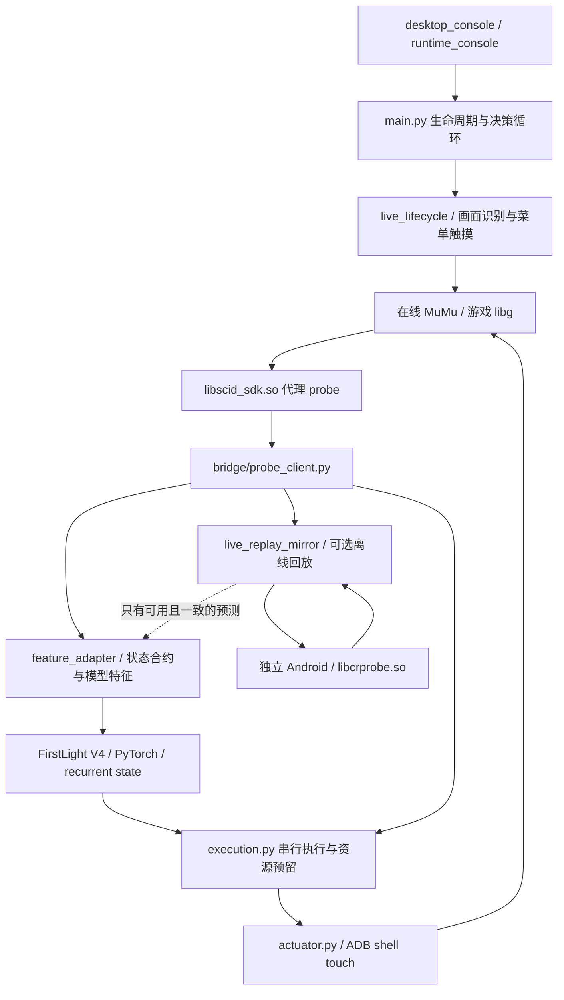

# RoyaleHarness 当前工程说明与部署手册

版本范围：2026-09-16 本地修改版。本文描述当前源码，历史 docs/SETUP.md、ARCHITECTURE.md 的部分默认值已过时。此版本不是一次干净机器完整重装认证。

## 1. 系统用途与边界

RoyaleHarness 将 Root Android 游戏里的原生状态转换成 FirstLight V4 模型输入，然后通过 ADB 触摸执行模型动作。在线路径没有 native command 写入。离线引擎用于实验性的回放、快照和预测，并不是在线进程的替代品。

已测试：真实在线读状态与触摸、模型切换、连续对局、结果页/奖励页 OK、英雄按钮、2.6 普通形态离线出牌、离线快照恢复。尚未证明：所有特殊形态完整模拟、策略强度提升、全量对手事件回放、任意新游戏版本兼容、零漏点。`action_missed` 是确认未知，不等于真实未出牌。

## 2. 架构



| 模块 | 职责 / 数据 |
| --- | --- |
| probe/nulls_probe.cpp 与 .inc/.S | 指纹验证、SDK 转发、controller 状态采集、JSON、RESET/ARM/ATTACH；没有在线下牌注入 |
| bridge/probe_client.py | GET 读取、身份匹配、tick 新鲜度、完整性校验、BattleState |
| agent/feature_adapter.py | ObservationV1、单位/塔/手牌/英雄、坐标视角、合法动作 mask、简化预测 |
| agent/policy_engine.py | 权重加载、预热、CPU/MPS/CUDA、循环状态、动作解码 |
| agent/execution.py | 一个进行中触摸、fresh validation、圣水预留、手牌/技能确认、UNKNOWN 记录 |
| bridge/actuator.py | 持久 ADB shell，选牌后间隔再点击目标；真实输入与 native 镜像独立 |
| live_lifecycle.py / bridge/lifecycle_screen.py | 结算 OK、奖励页 OK、大厅确认、开局、运行链路恢复 |
| desktop_console.py | Tk GUI、实时日志、模型与预测开关、离线服务启动 |
| bridge/full_simulator.py / live_replay_mirror.py | 配置离线局、重放已知动作、保存/恢复快照、分支外推、漂移检测 |

状态链：新对局身份 → 初始化观测/模型 → 决策 → 新状态复核 → 触摸 → 观察确认 → 下一次决策。native finalized 才触发终局；破一个公主塔不能结束循环。短暂无新 tick 只暂停读取，不能当作真实终局。

## 3. 时间与预测

- 原生 tick 为 50ms，正常决策最短间隔是 2 tick；模型自身 WAIT 和队列条件仍可能延长间隔。
- 触摸选牌间隔目前 40ms，不能把它当作游戏的部署动画。
- 简化位置外推最长 10 tick/500ms，不累积二阶加速度。已知目标含塔，进入估算射程后停步；无法完整推演目标切换、伤害和死亡。
- 滚木已不在模型决策后额外移动坐标。地面视角变换仍然必要。
- 原生离线外推配置仍为延迟补偿加 30 tick；这与简化预测上限不同。
- 缺少对手完整回放时，不把部分镜像的未来己方与当前敌方混合输入模型。服务 ready 不等于镜像可用，更不等于 `simulation_used=true`。
- 虚拟己方单位和圣水预留不属于权威 telemetry；UNKNOWN 不能标注执行成功。

最近日志示例：推理流水线中位数约 122ms、触摸约 89ms，不能作为所有机器保证。旧 `end_to_end_latency_ms` 从决策完成后开始计时；新 `observation_to_input_completed_ms` 包含观测返回至触摸完成，仍不含服务器确认和部署动画。离线 1 秒推进数毫秒的测试不包含在线同步/回滚/模型开销。

## 4. 依赖和分发

| 依赖 | 获取 / 要求 |
| --- | --- |
| RoyaleHarness | 当前源码包，保留 Apache-2.0、NOTICE、FirstLight notices |
| Python | macOS arm64 Python 3.12；需要 tkinter；虚拟环境不可跨机器复制 |
| Python 包 | deployment/requirements-macos-arm64.lock；wheelhouse 可本机重建 |
| FirstLight_CR | https://gitlab.com/firstlight3/FirstLight_CR；upstream.lock.json 是历史基线，当前外部源码有本地改动，须比对差异 |
| 权重 / 竞争数据 | 按 upstream.lock.json 和目录布局获取；Hog 默认 checkpoints/2_6hog_expert/hog26-specialist2.pt |
| MuMu / ADB | 用户自己的模拟器安装，Root、ADB 可用，ARM64 游戏 |
| 在线游戏 APK / libg / SDK | 用户自行提供匹配版本；不随公开包分发 |
| NDK | 本次构建用 30.0.16248370；Apple host 使用 darwin-x86_64 工具目录里的交叉编译器 |
| Xcode command line tools | 编译菜单 OCR；依赖 macOS Vision、Foundation、CoreGraphics |
| 离线引擎（可选） | https://github.com/Jason-XII/Clash-Royale-Battle-Engine；需要本地补丁和匹配 APK/probe |

本仓库 NOTICE 明确排除 APK、原始游戏 SDK、权重和游戏资源。发布包只包含可分发工程、构建脚本、校验清单和依赖取得方式。不能把原始 .venv 或整个 Downloads 压缩后公开。离线项目根目录没有找到 LICENSE，未将它的完整副本默认纳入公开包；本地源码差异需许可审查后再发布。

## 5. 新机器部署：macOS Apple Silicon

### 5.1 目录和 Python

准备相邻 RoyaleHarness、FirstLight_CR 目录。把权重按上表路径放入 FirstLight。先阅读它自己的依赖/资源说明，再配置本项目：

```bash
cd RoyaleHarness
python3.12 -m venv .venv
.venv/bin/python -m pip install --upgrade pip
.venv/bin/python -m pip install -r deployment/requirements-macos-arm64.lock
.venv/bin/python -c 'import torch, tkinter; print(torch.__version__, torch.backends.mps.is_available())'
```

锁定版本是当前机器实测版本。如软件源没有对应 wheel，报告缺项，不能静默换版本并宣称已复现。Windows 使用原有 setup.ps1，本文的 macOS 锁和 GUI 启动器不可直接套用。

已有完整 wheelhouse 时使用 `pip install --no-index --find-links wheelhouse -r deployment/requirements-macos-arm64.lock`。只有全部依赖及传递依赖都有兼容 wheel 时才称离线安装完成。

### 5.2 实例与配置

建立在线实例；需要离线引擎时再建立独立实例。确认 `adb devices -l`、对应实例的 `shell su -c id` 与 `shell wm size`。实例名称、是否勾选 5555 均不能证明序列号。

从 deployment/settings.macos.example.json 创建根目录 settings.local.json，填写实测 adb_path、adb_serial、firstlight_dir。先保持 account_id=null、calibration_verified=false、enable_full_simulation=false。

GUI 与 CLI 均使用同一个绝对配置路径：

```bash
export CR_AGENT_SETTINGS="$PWD/settings.local.json"
```

GUI 在没有该环境变量时仍兼容已有 settings.device2.local.json；迁移时必须注意它可能与 settings.local.json 指向不同实例。配置变更需要重启 Python 进程。

在线映射示例为 host 26890 → 在线 guest 26888；离线为 host 26790 → 离线 guest 26789。host 端口可选，guest 编译端口不可随意更改。不要交换两个实例的包或 probe。

### 5.3 编译和安装在线 probe

```bash
export ANDROID_NDK_ROOT=/absolute/path/to/android-ndk
sh deployment/build_live_probe.sh
.venv/bin/python tools/install_probe.py --check --probe-path probe/artifacts/candidates/stale-recovery/libscid_sdk.so
.venv/bin/python tools/install_probe.py --probe-path probe/artifacts/candidates/stale-recovery/libscid_sdk.so
```

安装会校验游戏 SHA、备份原始 SDK 并重启指定在线客户端。必须显式传候选路径，旧默认 stable-retry 并不包含最新超时恢复修复。编译通过不能代替实机验证。

大厅 GET 返回 in_battle=false 是正常的；活跃对局应连续返回递增 tick。最新 probe 超时返回 stale，保留新 tick 恢复能力；RESET 与 controller teardown 仍负责对局失效。

### 5.4 身份、校准和菜单 OCR

在一场人工对局中运行 `.venv/bin/python tools/inspect_players.py`，用画面卡组/账号证据确定自己的 accountId。owner 会跨局变化，不能固定为 0。完成 docs/CALIBRATION.md 的地面和手牌校准后再设置 calibration_verified=true。英雄按钮单独参照 ability_calibration.example.json。

编译菜单识别工具：

```bash
clang -fobjc-arc -framework Foundation -framework Vision -framework CoreGraphics tools/lifecycle_ocr.m -o .venv/bin/lifecycle-ocr
```

生命周期坐标必须来自该机器。结算页 OK 和奖励页 OK 是不同位置；不能以一次端口连接或一个菜单识别结果代表完整回大厅验证。

### 5.5 验收与启动

```bash
.venv/bin/python tools/preflight.py --device-check --model hog26
.venv/bin/python main.py --checkpoint hog26 --device mps --dry-run --once
.venv/bin/python desktop_console.py
```

只读测试不加 --start-battle/--continuous，手动进入对局。确认真实状态可推理后，再使用 GUI 接管当前对局或启动连续对战。在线同一实例只允许一个触摸 runner。完整验收应记录出牌确认、终局、两个 OK、大厅、第二局新身份和持续递增 tick。

### 5.6 可选离线引擎

先配置 full_simulation_serial 为不同于 adb_serial 的实际设备，并提供自己的 FirstLight 离线 APK。UI 已拒绝省略离线序列号或复用在线序列号。修补的引擎源码、构建产物必须匹配；标准下载二进制不能自动视为具有本地快照/2.6 支持。

```bash
.venv/bin/python tools/start_full_engine.py --serial OFFLINE_SERIAL --port 26790 --engine-root /absolute/path/to/engine --adb /absolute/path/to/adb
```

该命令会安装 APK、替换离线 probe 并启动 headless 服务。APK 名称 .apk.1 会被暂存为 .apk。服务 ready 后还须测试 configure、八卡 consume、snapshot/restore，以及带实体场景的耗时。当前普通 2.6 已有离线验证，英雄/进化和完整对手回放仍有限制；建议首次部署保持在线镜像关闭。

## 6. 常见故障

| 现象 | 检查顺序 |
| --- | --- |
| ADB forward 失败 | 实际 serial → adb devices → forward 列表，不能用旧机器配置 |
| RESET 空响应 | 正确 guest/probe/PID/库指纹，端口 connect 不等于 JSON 正常 |
| 新局 tick 239 后 idle | 检查是否仍安装旧 probe；新 stale 恢复补丁要重启游戏才加载 |
| simulation_mirror_disabled | 看 reason；缺对手回放时这是预期保护，不是模型停止 |
| action_missed | 触摸完成与真实 consume 分别核对，不盲目重放写操作 |
| 一直 WAIT | 查新鲜 tick、pending/圣水/合法候选、模型会话；日志刻意不记录每次 WAIT |
| 卡在奖励页 | 正确 OCR 二进制、两种 OK、窗口/分辨率校准 |
| 法术/兵种落点后移 | 区分 native/model/UI 坐标与预测；滚木不应有额外 target_lead_applied |
| GPU 换后没变化 | CPU/MPS 全流程实际测量；不要仅用 GPU 型号或引擎推进 benchmark 下结论 |

## 7. 发行与校验

使用 deployment/package_portable.py 输出白名单源码 ZIP 与 SHA256SUMS.json；可单独下载 Python wheels。GitHub 上传应使用本人的目标仓库，保留原作者 attribution。APK/权重/原始 SDK 不放 Git；大依赖用许可允许的 Release assets，仍需要版本、平台和 SHA 校验。

每次交付注明：源码编译、合成测试、在线只读、真实下牌、离线 replay、完整连续对战分别验证到了哪一层。本文的历史性能数字不代表新安装环境已通过。
